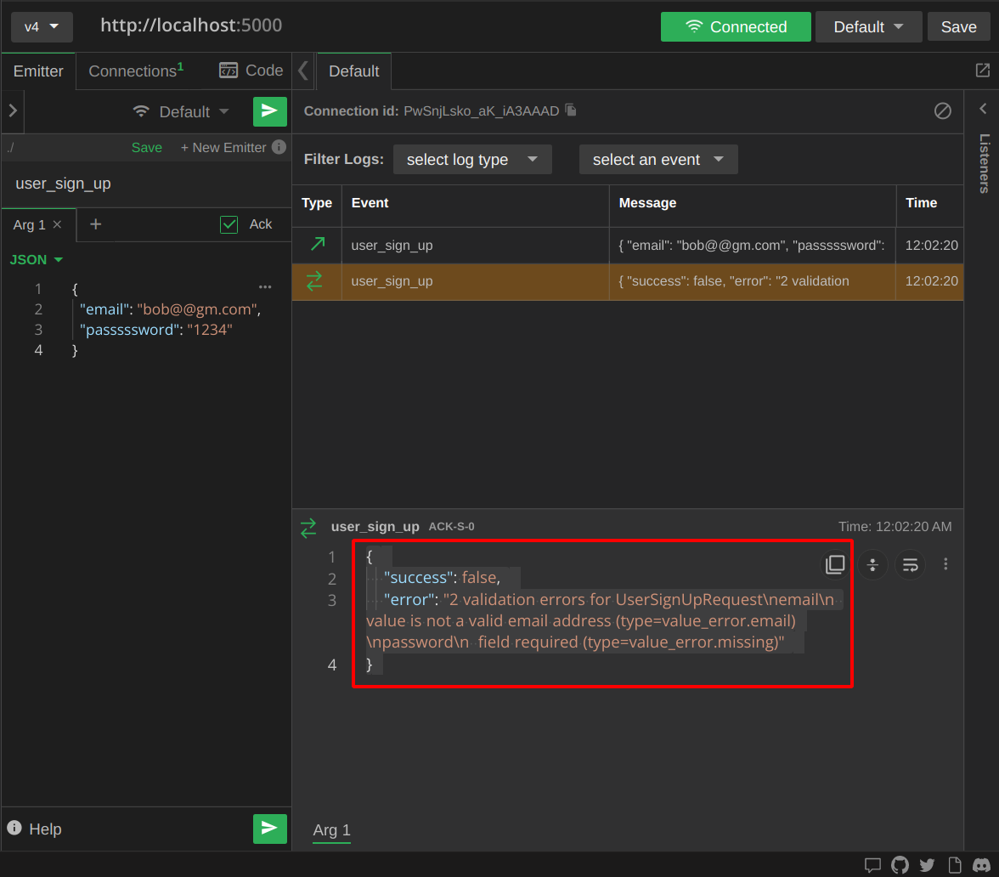
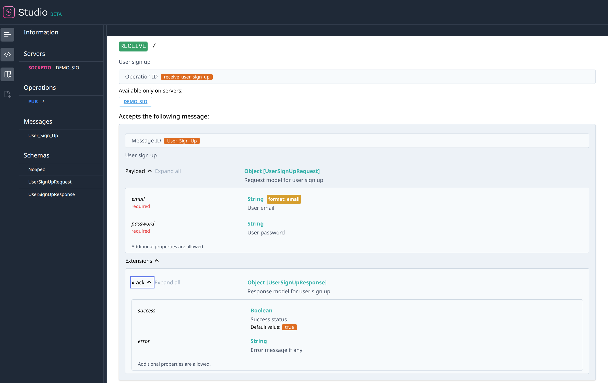

SIO-AsyncAPI
============

[![PyPI Version][pypi-image]][pypi-url]
[![Build Status][build-image]][build-url]
[![Code Coverage][coverage-image]][coverage-url]
[![][versions-image]][versions-url]

...

<!-- Badges: -->

[pypi-image]: https://img.shields.io/pypi/v/sio_asyncapi
[pypi-url]: https://pypi.org/project/sio_asyncapi/
[build-image]: https://github.com/daler-rahimov/sio-asyncapi/actions/workflows/python-package.yml/badge.svg
[build-url]: https://github.com/daler-rahimov/sio-asyncapi/actions/workflows/python-package.yml
[coverage-image]: https://codecov.io/gh/daler-rahimov/sio-asyncapi/branch/develop/graph/badge.svg
[coverage-url]: https://app.codecov.io/gh/daler-rahimov/sio-asyncapi
[versions-image]: https://img.shields.io/pypi/pyversions/sio_asyncapi/
[versions-url]: https://pypi.org/project/sio_asyncapi/


SIO-AsyncAPI is a Python library built on the top of [Flask-SocketIO](https://flask-socketio.readthedocs.io/) and driven by [AsyncAPI](https://www.asyncapi.com/). It allows you to generate an AsyncAPI specification from your SocketIO server and validate messages against it.

Similar to FastAPI, SIO-AsyncAPI allows you to define your SocketIO server using Python type annotations and Pydantic models. It also provides a way to generate an AsyncAPI specification from your SocketIO server.


## Installation

```bash
pip install sio_asyncapi
```

## Basic Example

https://github.com/daler-rahimov/sio-asyncapi/blob/c044e9600d7a87978f4048f5fc98d92ac54ee6b0/examples/simple.py#L1-L58

Here how validation error looks like in FireCamp:


In order to get the AsyncAPI specification from your SocketIO server instead of running the server, you can do the following:
```python
import pathlib
if __name__ == "__main__":
    path = pathlib.Path(__file__).parent / "simple.yml"
    doc_str = socketio.asyncapi_doc.get_yaml()
    with open(path, "w") as f:
        f.write(doc_str)
    print(doc_str)

```
Example of the AsyncAPI specification generated from the above example:

https://github.com/daler-rahimov/sio-asyncapi/blob/c044e9600d7a87978f4048f5fc98d92ac54ee6b0/examples/simple.yml#L1-L90


Rendered version of the above AsyncAPI specification:


## Converting from Flask-SocketIO to SIO-AsyncAPI
SIO-AsyncAPI is built on top of Flask-SocketIO and all unit tests of Flask-SocketIO are tested against SIO-AsyncAPI. If you converting your SocketIO server from Flask-SocketIO to SIO-AsyncAPI, you can be sure that your SocketIO server will work as expected. When converting your SocketIO server from Flask-SocketIO to SIO-AsyncAPI, it's as simple as changing the import statement:

```python
# instead of `from flask_socketio import SocketIO`
from sio_asyncapi import AsyncAPISocketIO as SocketIO
...
# There are additional arguments that you can pass to the constructor of AsyncAPISocketIO
socketio = SocketIO(app)
...
```

## Missing Features
SIO-AsyncAPI is still in its early stages and there are some features that are not yet implemented. If you are interested in contributing to SIO-AsyncAPI any contribution is welcome. Here is the list of missing features:

- [ ] Support of AsycnAPI documentation and validation for `emit` messages
- [ ] Support of Flask-SocketIO `namespaces` and `rooms`
- [ ] Authentication and security auto documentation
